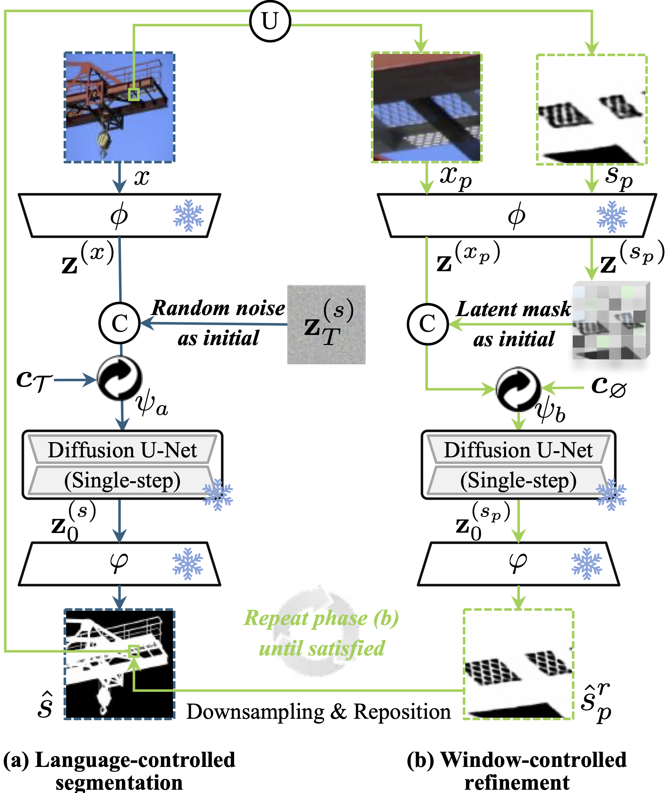

# LawDIS: Language-Window-based Controllable Dichotomous Image Segmentation (ICCV 2025)

<div align='center'>
    <a href='https://scholar.google.com/citations?user=bYLzUgYAAAAJ&hl' target='_blank'><strong>Xinyu Yan</strong></a><sup> 1,2,6</sup>,&thinsp;
    <a href='https://sunmeijun.github.io/' target='_blank'><strong>Meijun Sun</strong></a><sup> 1,2</sup>,&thinsp;
    <a href='https://scholar.google.com/citations?hl=zh-CN&user=oaxKYKUAAAAJ' target='_blank'><strong>Ge-Peng Ji</strong></a><sup> 3</sup>,&thinsp;
    <a href='https://scholar.google.com/citations?user=zvaeYnUAAAAJ&hl=zh-CN&oi=ao' target='_blank'><strong>Fahad Shahbaz Khan</strong></a><sup> 6</sup>,&thinsp;
    <a href='https://scholar.google.com/citations?user=M59O9lkAAAAJ&hl=zh-CN&oi=ao' target='_blank'><strong>Salman Khan</strong></a><sup> 6</sup>,&thinsp;
    <a href='https://scholar.google.com/citations?user=kakwJ5QAAAAJ&hl=zh-CN&oi=ao' target='_blank'><strong>Deng-Ping Fan</strong></a><sup> 4,5*</sup>
</div>

<div align='center'>
    <sup>1 </sup>Tianjin University&ensp;  <sup>2 </sup>Tianjin Key Laboratory of Machine Learning&ensp;  <sup>3 </sup>Australian National University&ensp; 
    <br />
    <sup>4 </sup>Nankai Institute of Advanced Research (SHENZHEN FUTIAN)&ensp;  <sup>5 </sup>Nankai University&ensp;  <sup>6 </sup>MBZUAI&ensp; 
</div>

<div align="center" style="display: flex; justify-content: center; flex-wrap: wrap;">
  <a href='https://arxiv.org'></a>&ensp; 
  <a href='https://github.com/XinyuYanTJU/LawDIS'></a>&ensp; 
  <a href='https://drive.google.com/drive/folders/1cLmMm2PIrZ00lWuz2EvudNH-7zg6Cn9w?usp=sharing'></a>&ensp; 
  <a href='LICENSE'></a>&ensp; 
</div>

<br>
<p align="center">
     <br />
</p>

This repo contains the source code and prediction results of our paper [_LawDIS: Language-Window-based Controllable Dichotomous Image Segmentation_](https://arxiv.org/pdf/) accepted by ICCV 2025. In this paper, we present LawDIS, a language-window-based controllable dichotomous image segmentation (DIS) framework that produces high-quality object masks. 


The following is a quick video to introduce our work:

https://github.com/user-attachments/assets/a3eaf703-d3db-4ba3-87a5-9c6fed09b569


## 🚀 1. Features

<p align="center">
     <br />
    <em> 
    Fig. 1: Illustration of the proposed macro and micro controls for DIS. The macro mode enables users to segment objects with customised language prompts, while micro mode supports post-refinement on user-defined windows at any scale. After refinement, our results become more precise, whereas the runner-up model, MVANet, lacks adaptability to the cropped local patches, resulting to inferior predictions.
    </em>
</p>

- **Framework innovation.** We recast the DIS task as an image-conditioned mask generation problem within a latent diffusion model. This enables LawDIS to seamlessly integrate both macro and micro user controls under a unified model and a shared set of parameters.

- **Dual control modes.** LawDIS employs a mode switcher to coordinate two distinct control modes. In macro mode, a language-controlled segmentation strategy (LS) generates an initial mask guided by user prompts. In micro mode, a window-controlled refinement strategy (WR) supports unlimited refinements on user-specified regions via size-adjustable local windows, enabling precise delineation of fine structures.

- **Flexible adaptation.** LS and WR can function independently or in collaboration. Their joint use meets high-accuracy personalized demands, while the micro mode (WR) alone can serve as a general-purpose post-refinement tool to enhance outputs from any segmentation model.

- **Superior performance.** Extensive evaluations on the DIS5K benchmark demonstrate that LawDIS consistently outperforms 11 state-of-the-art methods. Compared to the second-best model MVANet, LawDIS achieves a 3.6% $F_\beta^\omega$ improvement using LS alone, and a 4.6% gain when combining both LS and WR on DIS-TE.

## 📢 2. News
- **2025.07** 💻 We have open-sourced the **core code** of LawDIS!
- **2025.06** 🎉 Our paper has been accepted by **[ICCV 2025, Honolulu, Hawai'i](https://iccv.thecvf.com/)**!  

> This project is still a work in progress, and we invite all to contribute to making it more accessible and useful. If you have any questions about our paper, feel free to contact me via e-mail (xinyuyan@tju.edu.cn). If you are using our code for your research, please cite this paper ([BibTeX](#-9-citations)).

## ♟️3. Proposed Framework

Our framework recasts DIS as an image-conditioned mask generation task within a latent diffusion model, enabling seamless integration of user controls. LawDIS is enhanced with macro-to-micro control modes. Specifically, in macro mode, we introduce a language-controlled segmentation strategy (LS) to generate an initial mask based on user-provided language prompts. In micro mode, a window-controlled refinement strategy (WR) allows flexible refinement of user-defined regions (i.e., size-adjustable windows) within the initial mask. Coordinated by a mode switcher, these modes can operate independently or jointly, making the framework well-suited for high-accuracy, personalised applications.

<table align="center">
  <tr>
    <td align="center" valign="top" >
      <br/>
      <div style="height: 50px;">
        <sub><em>Fig. 2: An overview of the U-Net training protocol in LawDIS.</em></sub>
      </div>
    </td>
    <td align="center" valign="top" >
      <br/>
      <div style="height: 50px;">
        <sub><em>Fig. 3: Overview of the inference protocol, which consists of two steps.</em></sub>
      </div>
    </td>
  </tr>
</table>


## 🛠️ 4. Setup

### 4.1. Repository
Clone the repository (requires git):
```bash
git clone https://github.com/XinyuYanTJU/LawDIS.git
cd LawDIS
```

### 4.2. Dependencies
#### ✅ Step 1. Install the dependencies:
```bash
conda create -n lawdis python=3.8
conda activate lawdis
pip install -r requirements.txt
```

#### ✅ Step 2. Integrate Custom VAE into `diffusers`

This project uses a custom VAE class `AutoencoderKlLawDIS` that needs to be manually added into the `diffusers` library.

```bash
bash install_lawdis_diffusers.sh
```

### 4.3. Dataset Preparation

Download the **DIS5K dataset** from this [Google Drive link](https://drive.google.com/file/d/1O1eIuXX1hlGsV7qx4eSkjH231q7G1by1/view?usp=sharing) or [Baidu Pan link](https://pan.baidu.com/s/1y6CQJYledfYyEO0C_Gejpw?pwd=rtgw) with the fetch code: `rtgw`. Unzip the dataset and move the DIS5K folder into the LawDIS/data directory.

The language prompts we annotated for DIS5K can be found in `LawDIS/data/json/`.

### 4.4. Inference
#### ✅ Step 1. Download the Checkpoints

Download the pre-trained checkpoints from this [Google Drive link](https://drive.google.com/drive/folders/1RDBTj5-Z9Ek9wqnYoQHkFz4_zCFwiKK_?usp=drive_link) or [Baidu Pan link](https://pan.baidu.com/s/1DGqK_Nl3ccv_pi4mIOMndw) with the fetch code: `2025`.
Place the checkpoint files under:

```bash
.stable-diffusion-2/
```

---

#### ✅ Step 2. Inference in **Macro** Mode

We provide scripts for:
- **Batch testing** a dataset
- Testing **a single image** with multiple language prompts

**Batch Testing**

```bash
python script/infer_macro.py \
    --checkpoint "stable-diffusion-2" \
    --input_rgb_dir "data/DIS5K" \
    --subset_name "DIS-TE4" \
    --prompt_dir 'data/json' \
    --output_dir "output/output-macro" \
    --denoise_steps 1 \
    --processing_res 1024 
```

**Single Image with Prompts**

```bash
python script/infer_macro_single.py \
    --checkpoint "stable-diffusion-2" \
    --input_img_path "data/imgs/2#Aircraft#7#UAV#16522310810_468dfa447a_o.jpg" \
    --prompts "Black professional camera drone with a high-definition camera mounted on a gimbal." "Three men beside a UAV." \
    --output_dir 'output/output-macro-single' \
    --denoise_steps 1 \
    --processing_res 1024 
```

---

#### ✅ Step 3. Inference in **Micro** Mode

We provide scripts for:
- **Batch testing** a dataset
- Testing **a single image**

You can choose how to generate the refinement windows using `--window_mode`:
- `"auto"`: Automatically select windows based on object edges in the initial segmentation map.
- `"semi-auto"`: Simulate user-guided selection using GT segmentation.
- `"manual"`: User manually selects windows (⚠️ Only works on **local servers**).

**Batch Testing**

```bash
python script/infer_micro.py \
    --checkpoint "stable-diffusion-2" \
    --input_rgb_dir "data/DIS5K" \
    --subset_name "DIS-TE4" \
    --init_seg_dir 'output/output-macro/' \
    --output_dir "output/output-micro/" \
    --window_mode "semi-auto" \
    --denoise_steps 1 \
    --processing_res 1024 
```

**Single Image Testing**

```bash
python script/infer_micro_single.py \
    --checkpoint "stable-diffusion-2" \
    --input_img_path "data/imgs/2#Aircraft#7#UAV#16522310810_468dfa447a_o.jpg" \
    --init_seg_dir 'output/output-macro-single/2#Aircraft#7#UAV#16522310810_468dfa447a_o_0.png' \
    --output_dir "output/output-micro-single" \
    --window_mode "auto" \
    --denoise_steps 1 \
    --processing_res 1024 
```
## 🏋️ 5. Results

The predicted segmentation maps of both **Macro (Ours-S)** and **Micro (Ours-R)** modes can be downloaded from this [Google Drive link](https://drive.google.com/drive/folders/16WlZEq4NQso3gP3AdYcbdNf9Q0_KjZHN?usp=sharing) or [Baidu Pan link](https://pan.baidu.com/s/1em-6dEh2Qr2si17zi-CCxg) with the fetch code: `lawd`.

<p align="center">
     <br />
    <em> 
    Fig. 4: Quantitative comparison of DIS5K with 11 representative methods.
    </em>
</p>

<p align="center">
     <br />
    <em> 
    Fig. 5: Qualitative comparison of our model with four leading models. Local masks are evaluated with MAE score for clarity.
    </em>
</p>

## 🎮 6. Applications
Due to its capability of achieving high-precision segmentation of foreground objects at high resolutions, our LawDIS enables extensive application across a variety of scenarios. Fig. 6 shows application cases of background removal. As can be seen, compared with the original image, the background-removed image shows higher aesthetic values and good usability, which can even be directly used as: 3D modeling, augmented reality (AR), and still image animation.
<div align="center">
  <table>
    <tr>
      <td></td>
      <td></td>
      <td></td>
    </tr>
  </table>
  <em>
    Fig. 6: Application cases of background-removed results in various scenarios.
  </em>
</div>

<p align="center">
     <br />
    <em> 
    Fig. 7: Application cases of 3D modeling.
    </em>
</p>

<p align="center">
     <br />
    <em> 
    Fig. 8: Application cases of AR.
    </em>
</p>

<p align="center">
     <br />
    <em> 
    Fig. 9: Application cases of still image animation.
    </em>
</p>

## 📦 7. Related work
Our code is based on 

- Marigold: Repurposing Diffusion-Based Image Generators for Monocular Depth Estimation, [Github](https://github.com/prs-eth/marigold)

- Diffusers, [Github](https://github.com/huggingface/diffusers) .

We are grateful to the authors of these projects for their pioneering work and contributions!

## ✏️ 8. To do
- [ ] Training code; 
- [ ] Huggingface app demo.

## 🎓 9. Citations
If you find this code useful, we kindly ask you to cite our paper in your work.
```
@article{LawDIS,
  title={LawDIS: Language-Window-based Controllable Dichotomous Image Segmentation},
  author={},
  journal={},
  year={2025}
}

```
